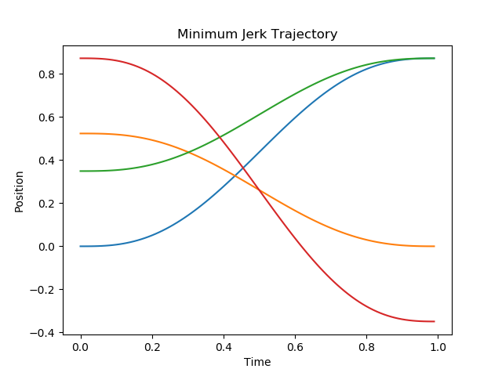

# Minimum Jerk Trajectory Generation

This is an example code for generating minimum jerk trajectory that usually used to generate smooth trajectory for servo motor in robotics domain. 

**Example result:**

